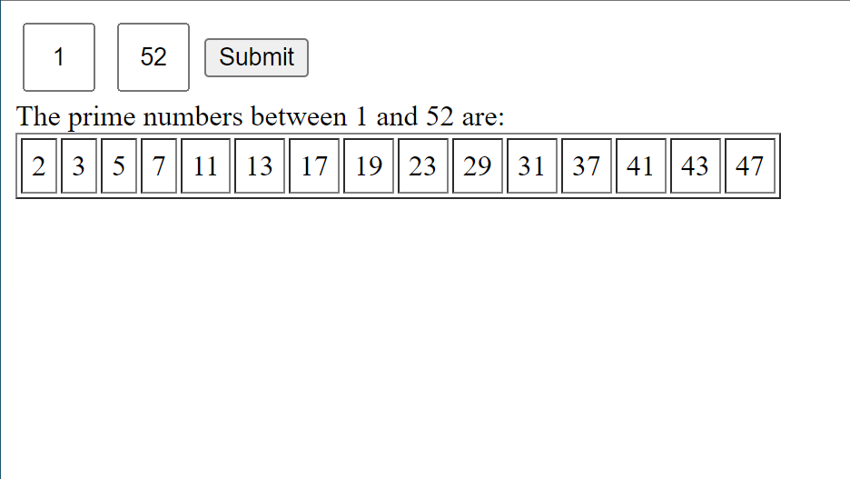

# PHP 2x2 Multiplier  
## Goal  
 - Become familiar with PHP
 - Use PHP with XAMPP to make a local server that can host PHP files
 - Develop skills with user input using $_POST
## Description  
1. Create a form that lets user input two matrices, A and B. Each matrix should have two rows and two columns. This form does not provide any client-side data validation. Process the data submitted by the form using PHP such that:
 - Data is validated on the server-side to not allow any empty fields and to only allow a number in each input field; 
 - The two matrices as well as their product are displayed in three separate tables. 

2. Create a form that lets user input two positive integers. Form data should be processed using PHP to: 
 - Validate input data on the server to allow only positive integers;  
 - Display all prime numbers between the two positive integers in a table that has a separate cell for each prime number. 

